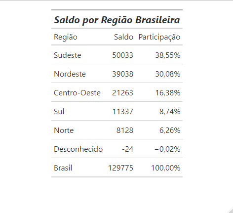
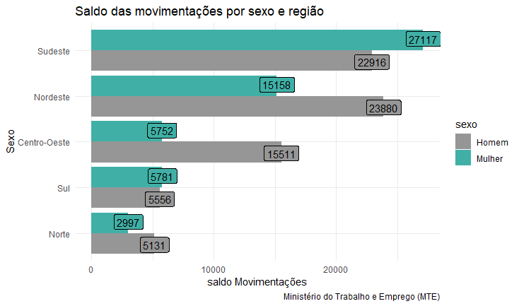

# CAGED

Projeto para acesso, tratamento e visualização de microdados do CAGED utilizando a linguagem R. O objetivo é facilitar a análise de empregabilidade por meio de tabelas, gráficos e mapas, tornando os dados acessíveis para analistas e pesquisadores da área.

## Objetivo

Este projeto demonstra como acessar, tratar e gerar outputs a partir dos microdados do CAGED, facilitando o processo de análise e tomada de decisão para profissionais interessados no mercado de trabalho brasileiro.

## Funcionalidades

- **Acesso aos microdados do CAGED**  
  Scripts em R para baixar e ler os dados diretamente dos repositórios oficiais.

- **Tratamento dos dados**  
  Limpeza, filtragem e organização dos dados para análise eficiente.

- **Geração de outputs**  
  - **Tabelas**: Resumos estatísticos dos principais indicadores de empregabilidade.
  - **Gráficos**: Visualizações para facilitar o entendimento dos dados.
  - **Mapas**: Distribuição geográfica das informações.

## Como utilizar

### 1. Instalação dos pacotes necessários

```
install.packages("archive")
install.packages("readr")
install.packages("tidyverse")
install.packages("gt")
install.packages("summarytools")
install.packages("scales")
```

### 2. Execução dos scripts

Os códigos estão disponíveis em dois arquivos principais:

- `acesso_e_tratamento.R`: Realiza o download e tratamento dos microdados.
- `visualizacao.R`: Gera tabelas, gráficos e mapas dos dados tratados.

#### Exemplo de uso

```r
# Tabela saldo por região

tabela_br <- caged %>%
  group_by(região) %>%
  filter(região != "Desconhecido") %>%
  summarise(saldo = sum(saldomovimentação, na.rm = T)) %>%
  arrange(desc(saldo))

Total_br <- tibble(
  região = "Brasil",
  saldo = sum(tabela_br$saldo, na.rm = T)
)

tabela_br <- bind_rows(tabela_br, Total_br)

tabela_br %>%
  mutate(
    percentual = saldo / Total_br$saldo
  ) %>%
  gt() %>%
  tab_header(
    title = md("***Saldo por Região Brasileira***")
  ) %>%
  fmt_percent(
    columns = percentual,
    decimals = 2,
    dec_mark = ",",
    sep_mark = "."
  ) %>%
  cols_label(
    região = "Região",
    saldo = "Saldo",
    percentual = "Participação"
  )
```

## Estrutura do projeto

```
├── acesso_e_tratamento.R
├── visualizacao.R
├── README.md
└── exemplos/
    ├── exemplo_tabela.png
    ├── exemplo_grafico.png
    └── exemplo_mapa.png
```

## Exemplos de outputs

Veja abaixo exemplos de outputs gerados pelo projeto:

- **Tabela**:  

- **Gráfico**:  

- **Mapa**:


## Créditos

Desenvolvido por [Well-Mariano](https://github.com/Well-Mariano)  
Referências:  
- Ministério do Trabalho – CAGED  
- Documentação oficial dos microdados

## Licença

Este projeto está sob a licença MIT.
